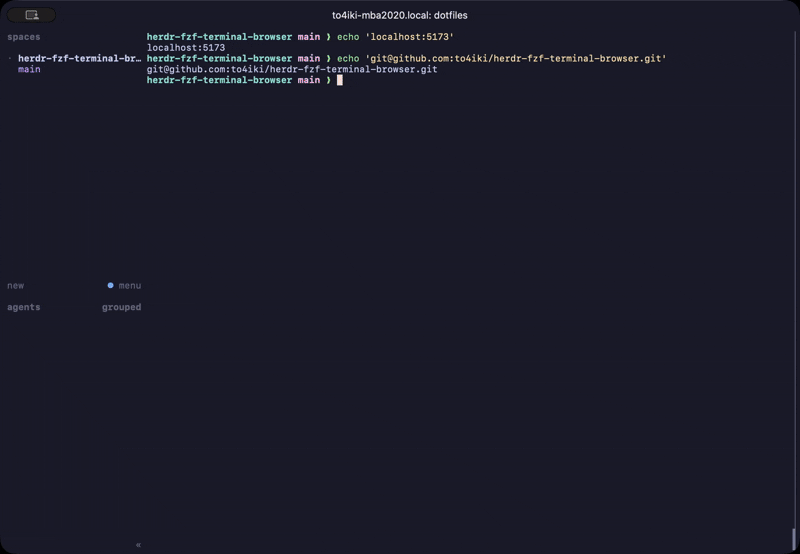

# herdr-fzf-terminal-browser


A herdr plugin: press a key, pick a URL printed in the current pane with `fzf`,
and it opens in terminal-browser — right next to the pane you are in.

- No terminal-browser in this herdr tab yet: one opens as a split to the right of the pane.
- Already one there: the URL opens as a new tab in it.

Everything stays inside the terminal: an agent's output on the left, the page it linked on the right.
The picker idea comes from [tmux-fzf-url](https://github.com/wfxr/tmux-fzf-url); the implementation is written for herdr and coding-agent output
(dev-server addresses like `localhost:5173` are recognised, Markdown links and JSON-embedded URLs come out clean).



## Requirements

- [herdr](https://herdr.dev) ≥ 0.8.2
- [terminal-browser](https://terminal-browser.com/) (run `terminal-browser setup` once)
- [fzf](https://github.com/junegunn/fzf)
- Rust toolchain (`cargo`) — the plugin is built from source when installed
- macOS or Linux

## Install

```sh
herdr plugin install to4iki/herdr-fzf-terminal-browser
```

Then bind a key in `~/.config/herdr/config.toml` and run `herdr server reload-config`:

```toml
[[keys.command]]
key = "prefix+f"
type = "plugin_action"
command = "to4iki.fzf-terminal-browser.pick"
description = "open url in terminal-browser"
```

Press `prefix+f` in any pane: the URLs currently on that pane's screen are listed, newest first.
What you see is what you can pick — no more, no less. If there is none, nothing happens.

| Key | Action |
|---|---|
| `enter` | open in terminal-browser and focus it (split, or new tab if one is already open in this herdr tab) |
| `ctrl-y` | copy to clipboard |
| `esc` | cancel |

If you have scrolled the pane back, the picker uses the part you scrolled to. Soft-wrapped lines are
joined back together so a long URL stays in one piece — except while scrolled back, where herdr can
only hand over the screen as rendered.

## What gets extracted

| Text in the pane | Opened as |
|---|---|
| `https://…`, `http://…`, `ftp://…`, `file://…` | as is |
| `localhost:5173`, `127.0.0.1:8080/x`, `0.0.0.0:3000`, `[::1]:4000` | `http://localhost:5173`, … |
| `10.0.0.5:8080/api` (IPv4 with port or path) | `http://10.0.0.5:8080/api` |
| `www.example.com/x` | `https://www.example.com/x` |
| `git@github.com:a/b.git`, `ssh://git@host/a/b.git` | `https://github.com/a/b` |

Trailing punctuation and unbalanced brackets are dropped (`[docs](https://a/b)` yields `https://a/b`,
Wikipedia-style `Foo_(bar)` is kept). Duplicates collapse to their newest occurrence.

## How it works

`prefix+f` runs the plugin action `pick`. An action has no TTY, so it only looks for URLs and, if it
finds any, opens the `picker` popup for that pane.

The picker reads the pane's screen with `herdr pane read`, runs fzf over the URLs it finds, and hands
the chosen one to `terminal-browser`: a new tab when a browser is already in this herdr tab, a new
split pane otherwise. Every `terminal-browser` call names the source pane, so the browser lands
beside the pane you pressed the key in, and focus follows it there (for a browser the plugin opened
itself — one you started by hand keeps the focus where it was).

The plugin runs only `herdr`, `fzf`, `terminal-browser`, and (for `ctrl-y`) the platform's clipboard tool,
and writes nothing outside its build directory. There is no configuration in this release.

## Not yet / ideas for later

Kept out of the first release on purpose. Open an issue if one of these would help you.

- Configuration (`config.toml`): split direction / size, extra fzf flags
- Scanning scrollback beyond the current screen
- Multi-select
- Talking to the herdr socket directly instead of spawning the `herdr` CLI (≈30 ms per call saved)
- URLs hidden behind OSC 8 hyperlinks (`pane read --format ansi`)
- Ctrl+click on a URL (`[[link_handlers]]`) opening in terminal-browser

## Command line

Open the picker without a keybinding:

```sh
herdr plugin action invoke to4iki.fzf-terminal-browser.pick
```

`open` and `extract` are subcommands of the binary rather than plugin actions, so `action invoke`
does not reach them; run the binary from the plugin directory (a checkout you linked with
`herdr plugin link`, or the `plugin_root` in `herdr plugin list --json`):

```sh
./target/release/herdr-fzf-terminal-browser open https://example.com   # open next to this pane
herdr pane read "$HERDR_PANE_ID" --source visible | ./target/release/herdr-fzf-terminal-browser extract
```

## Development

```sh
cargo test
cargo clippy --all-targets -- -D warnings
cargo build --release && herdr plugin link .      # then bind prefix+f as above
```

## License

MIT
